# Project Overview

This project demonstrates how to build a complete **End-to-End DevSecOps pipeline on AWS** using modern DevOps and GitOps tools. Starting from infrastructure provisioning to application deployment and monitoring, every stage is automated to showcase a production-inspired workflow.

Throughout this project, you will accomplish the following:

- **AWS IAM Configuration** – Create an IAM user with the required permissions for infrastructure provisioning and deployment.
- **Infrastructure as Code (IaC)** – Provision the Jenkins server on AWS using Terraform and configure AWS CLI for automation.
- **Jenkins Server Setup** – Install and configure Jenkins along with essential DevSecOps tools, including Docker, Terraform, Kubectl, AWS CLI, Trivy, SonarQube Scanner, and other required dependencies.
- **Amazon EKS Deployment** – Provision an Amazon EKS cluster using Terraform and manage it through Jenkins pipelines.
- **AWS Load Balancer Configuration** – Deploy and configure the AWS Load Balancer Controller to automatically provision an Application Load Balancer (ALB) for Kubernetes Ingress resources.
- **Amazon ECR Setup** – Create private Amazon Elastic Container Registry (ECR) repositories to securely store Docker images for both frontend and backend services.
- **Argo CD Installation** – Install and configure Argo CD to enable GitOps-based continuous delivery for Kubernetes applications.
- **SonarQube Integration** – Perform automated code quality analysis as part of the CI pipeline.
- **Jenkins CI/CD Pipelines** – Build complete Jenkins pipelines to:
  - Provision AWS infrastructure
  - Build Docker images
  - Run security and quality scans
  - Push images to Amazon ECR
  - Update Kubernetes manifests automatically
- **Container Security Scanning** – Integrate Trivy and OWASP Dependency Check to identify vulnerabilities in source code and container images.
- **Monitoring Stack Deployment** – Deploy Prometheus and Grafana using Helm to monitor the Kubernetes cluster and workloads.
- **GitOps Application Deployment** – Use Argo CD to deploy the complete Three-Tier application consisting of:
  - Database
  - Backend API
  - Frontend
  - Kubernetes Ingress
- **DNS Configuration** – Configure Route 53 and a custom domain to expose the application over the internet using an AWS Application Load Balancer.
- **Persistent Storage** – Configure Persistent Volumes (PV) and Persistent Volume Claims (PVC) to ensure database data persists across pod restarts.
- **Observability & Validation** – Monitor cluster health, application metrics, and deployment status using Grafana, Prometheus, Jenkins, and Argo CD dashboards.

By the end of this project, you will have built a fully automated **production-style DevSecOps platform** that incorporates Infrastructure as Code (IaC), Continuous Integration (CI), Continuous Delivery (CD), GitOps, container security scanning, monitoring, and Kubernetes best practices on AWS.

---

# Prerequisites

Before you begin, ensure you have:

- An AWS account
- Ubuntu/Linux machine
- Terraform installed
- AWS CLI installed
- Git installed
- SSH key pair created in AWS
- S3 Bucket for Terraform backend
- DynamoDB table for Terraform state locking

---

# Step 1: Create an IAM User

> **Note**
>
> For learning purposes this guide uses the **AdministratorAccess** policy.
> In production environments, always follow the **principle of least privilege**.

## 1. Open IAM

Navigate to:

```
AWS Console → IAM → Users
```

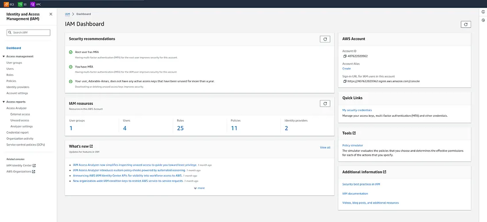

Click **Create User**.

---

## 2. Create the User

Provide a username.

Example:

```
jenkins-user
```

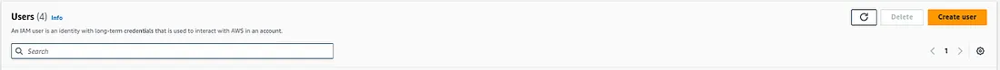

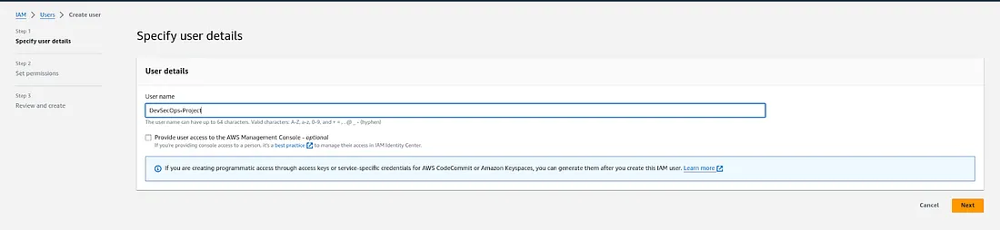

Click **Next**.

---

## 3. Assign Permissions

Select

```
Attach policies directly
```

Search for

```
AdministratorAccess
```

Select the policy.

Click **Next**.

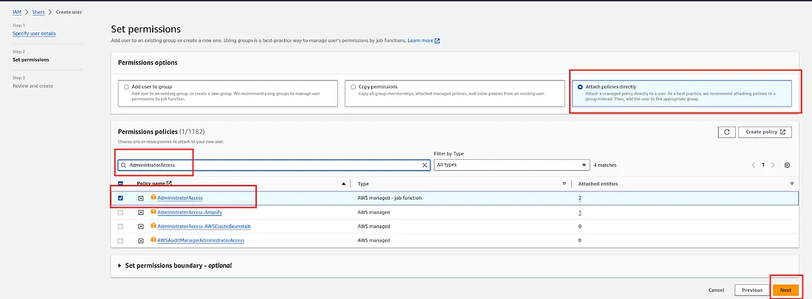

---

## 4. Create User

Review the configuration and click

```
Create User
```

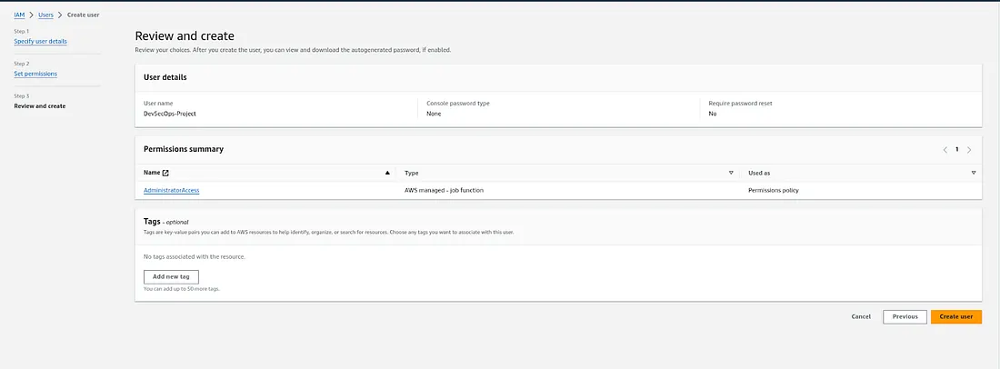

---

## 5. Generate Access Keys

Open the newly created user.

Navigate to

```
Security Credentials
```

Choose

```
Create Access Key
```

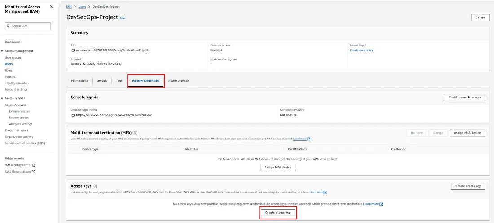

Select

```
Command Line Interface (CLI)
```

Accept the confirmation checkbox.

Click **Next**.

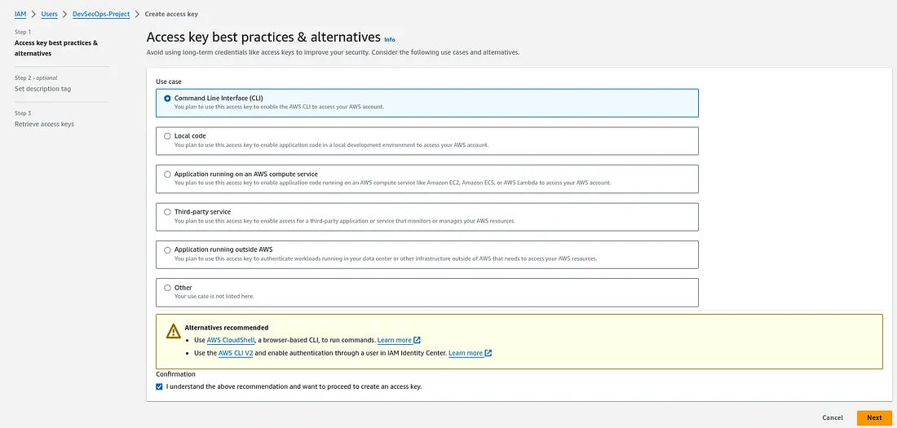

Optionally provide a description.

Click

```
Create Access Key
```

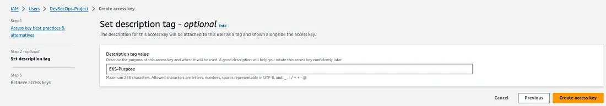

Save the following credentials safely:

- Access Key ID
- Secret Access Key

You can also download the CSV file for future reference.

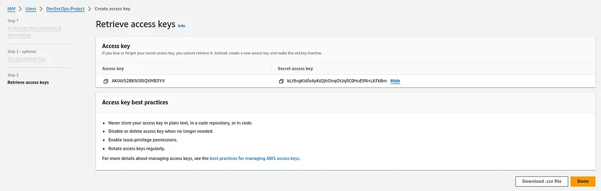

---

# Step 2: Install Terraform and AWS CLI

## Install Terraform

```bash
wget -O- https://apt.releases.hashicorp.com/gpg \
| sudo gpg --dearmor \
-o /usr/share/keyrings/hashicorp-archive-keyring.gpg

echo "deb [signed-by=/usr/share/keyrings/hashicorp-archive-keyring.gpg] \
https://apt.releases.hashicorp.com $(lsb_release -cs) main" \
| sudo tee /etc/apt/sources.list.d/hashicorp.list

sudo apt update

sudo apt install terraform -y
```

Verify installation:

```bash
terraform version
```

---

## Install AWS CLI

```bash
curl "https://awscli.amazonaws.com/awscli-exe-linux-x86_64.zip" \
-o "awscliv2.zip"

sudo apt install unzip -y

unzip awscliv2.zip

sudo ./aws/install
```

Verify installation:

```bash
aws --version
```

---

## Configure Terraform

Edit the file /etc/environment using the below command, add the highlighted lines and add your keys in the blur space.

```bash
sudo vim /etc/environment
```

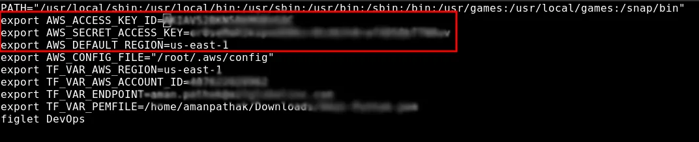

After making the changes, restart your machine to reflect the changes to your environment variables.

## Configure AWS Credentials

Run:

```bash
aws configure
```

Provide:

```
AWS Access Key ID
AWS Secret Access Key
Default Region (e.g. us-east-1)
Output format (json)
```

Example:

```text
AWS Access Key ID: AKIA...
AWS Secret Access Key: ****************
Default region name: us-east-1
Default output format: json
```

---

## Step 3: Deploy the Jenkins Server (EC2) Using Terraform

Clone the repository containing the Terraform configuration.

```bash
git clone https://github.com/asadjvd/jenkins-projects.git
cd E2E-K8s-3Tier-DevSecOps-Project
```

Navigate to the Jenkins-Server-TF directory.

```bash
cd Jenkins-Server-TF
```

### Configure the Terraform Backend

Before deploying the infrastructure, update the `backend.tf` file with your own backend configuration.

Modify the following values:

- S3 Bucket Name
- DynamoDB Table Name

> **Note**
>
> Ensure that both the S3 bucket and DynamoDB table have already been created in your AWS account.

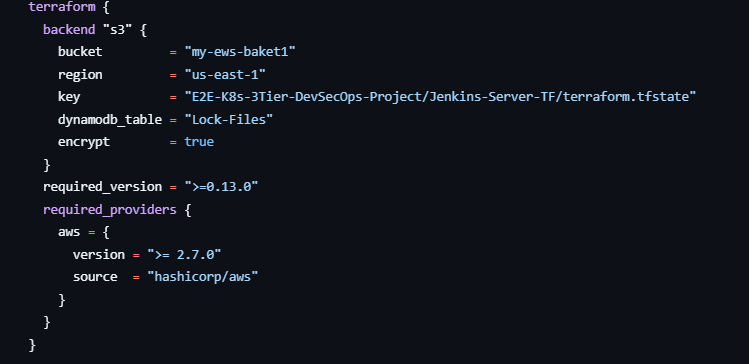

---

### Configure the EC2 Key Pair

Update the Terraform variables to use your existing AWS EC2 Key Pair.

Replace the default key pair name with your own.

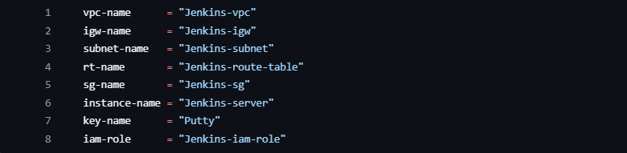

---

### Initialize Terraform

Initialize the Terraform working directory.

```bash
terraform init
```

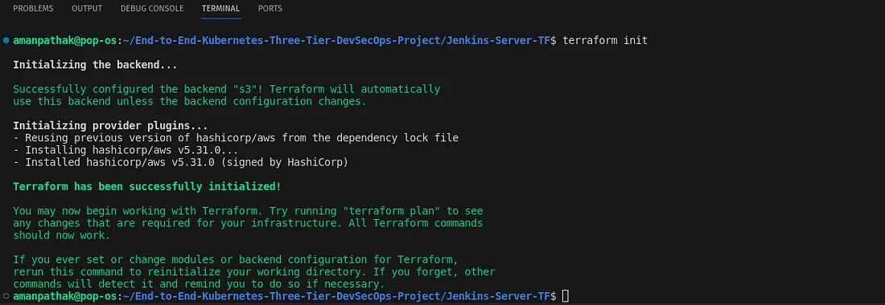

---

### Validate the Configuration

Verify that the Terraform configuration is valid.

```bash
terraform validate
```

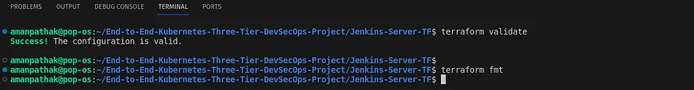

---

### Review the Execution Plan

Generate an execution plan to preview the AWS resources that will be created.

```bash
terraform plan -var-file=variables.tfvars
```


---

### Deploy the Infrastructure

Create the Jenkins server and all associated AWS resources.

```bash
terraform apply -var-file=variables.tfvars --auto-approve
```

The deployment typically completes within **3–5 minutes**.

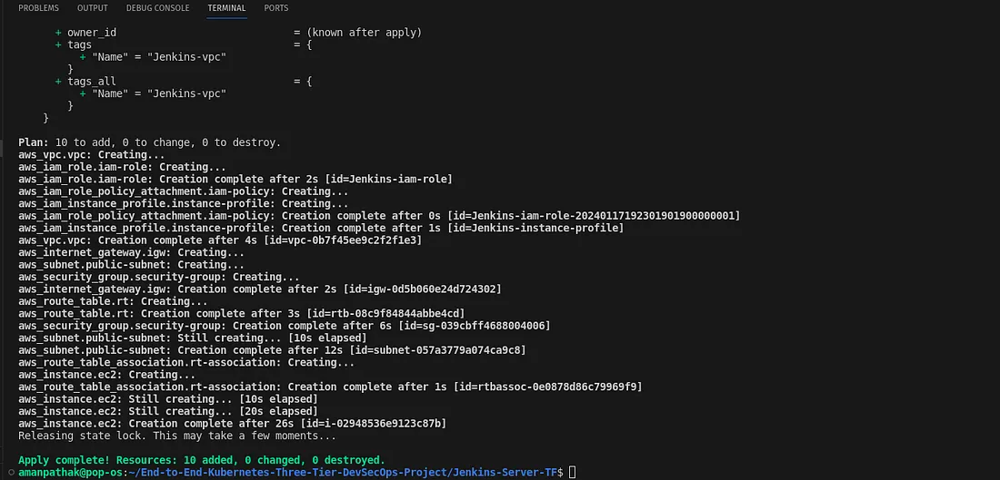

---

### Connect to the Jenkins Server

After the deployment completes, navigate to the EC2 console and connect to your instance.

Copy the SSH command and execute it from your local machine.

```bash
ssh -i <your-key.pem> ubuntu@<EC2_PUBLIC_IP>
```

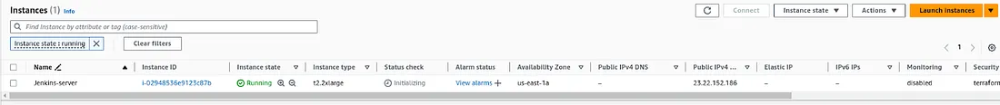

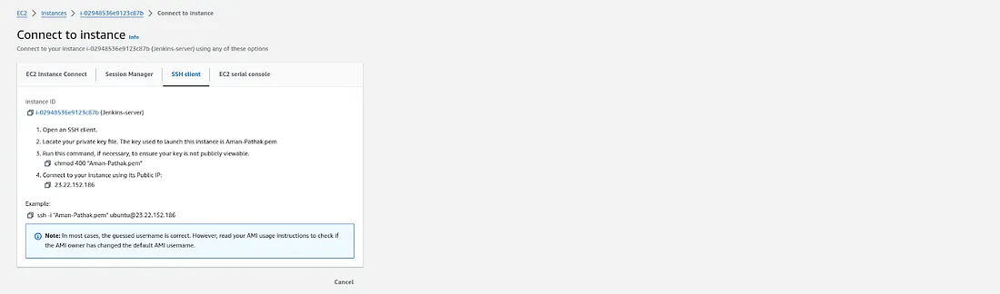

---

## Step 4: Configure Jenkins

After connecting to the EC2 instance, verify that all required DevSecOps tools have been installed successfully.

Run the following commands:

```bash
jenkins --version
docker --version
docker ps
terraform --version
kubectl version --client
aws --version
trivy --version
eksctl version
```

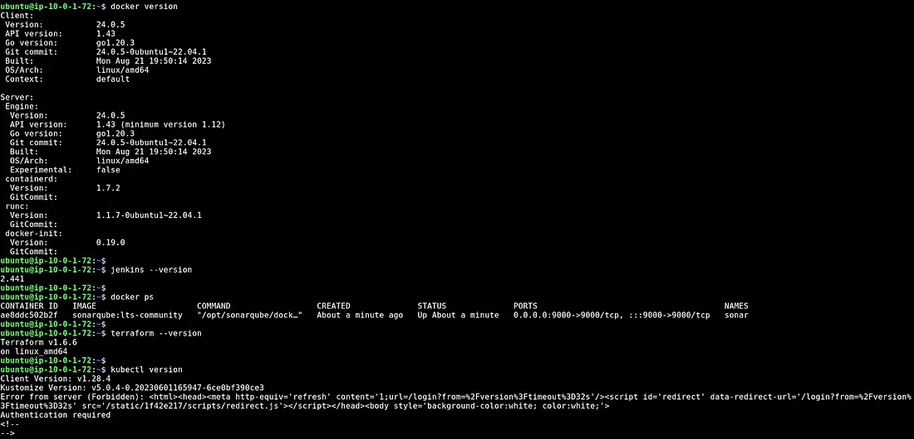

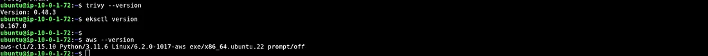

---

### Access the Jenkins Web Interface

Open your browser and navigate to:

```
http://<EC2_PUBLIC_IP>:8080
```

Retrieve the initial administrator password.

```bash
sudo cat /var/lib/jenkins/secrets/initialAdminPassword
```

Enter the password on the Jenkins setup page.

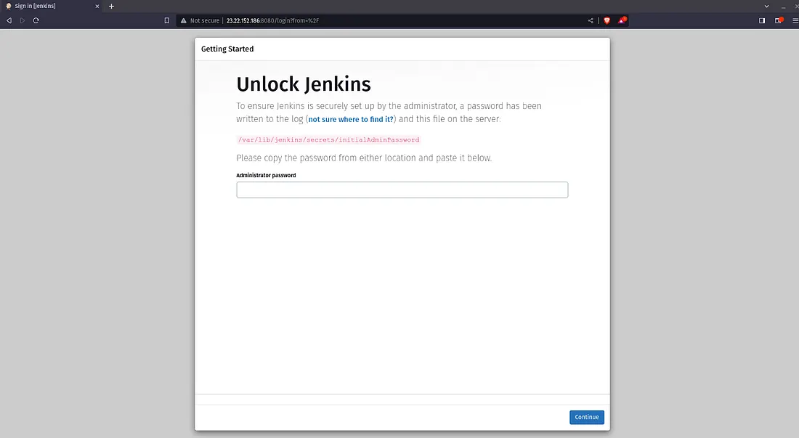

---

### Install Jenkins Plugins

Click:

**Install Suggested Plugins**

Wait for Jenkins to complete the plugin installation.

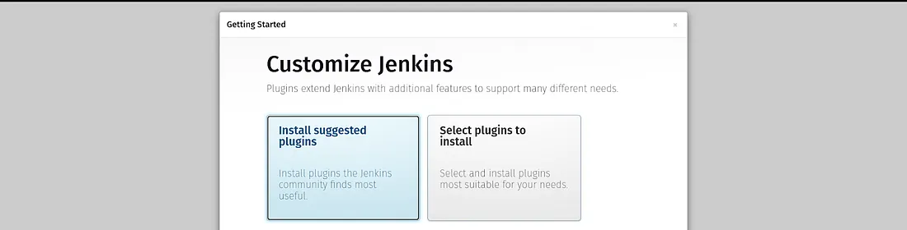

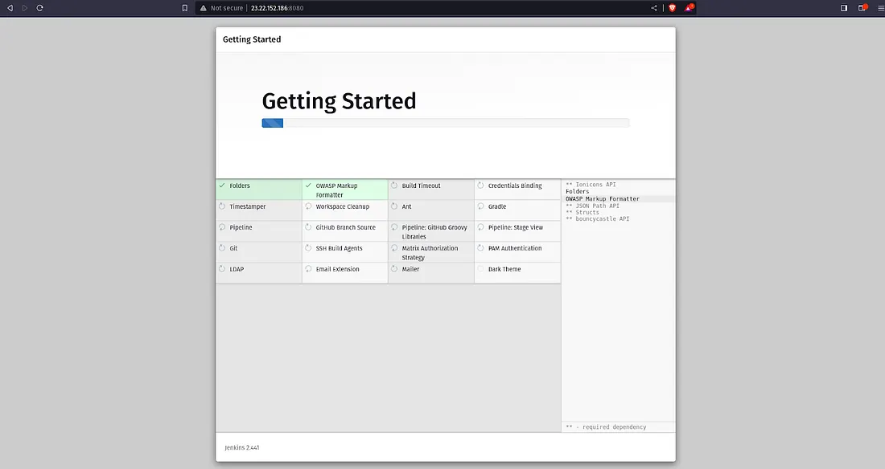

---

### Complete the Initial Setup

Once the installation is complete:

1. Continue as the administrator (or create an admin user).
2. Click **Save and Finish**.
3. Click **Start Using Jenkins**.

You should now see the Jenkins Dashboard.

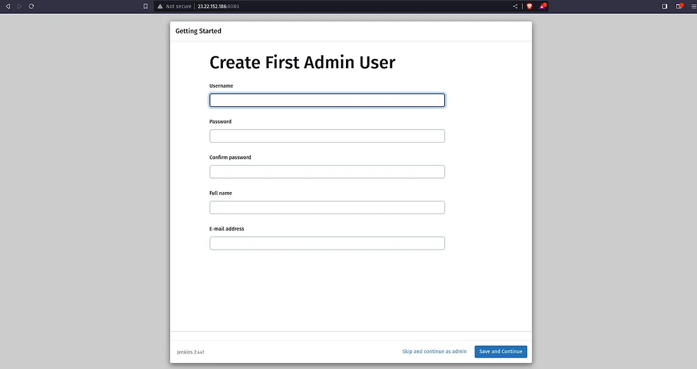

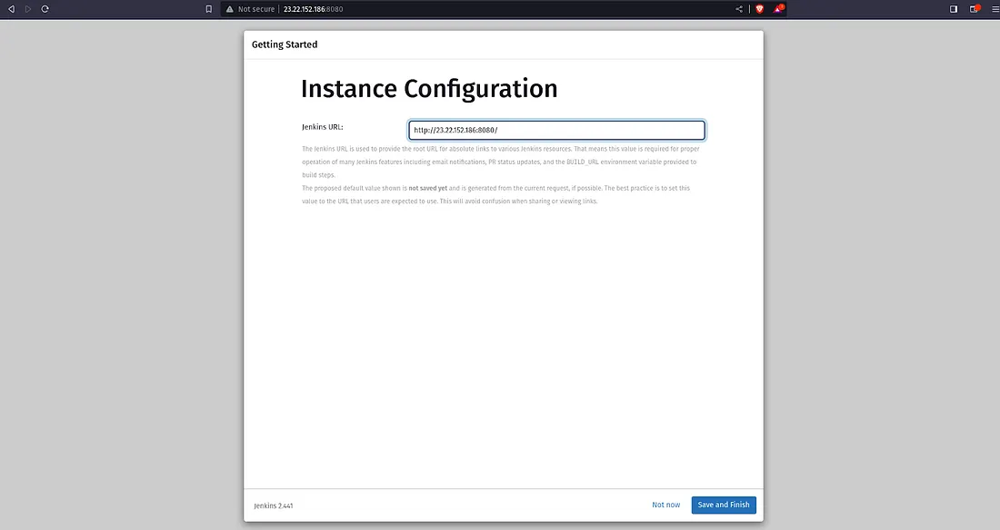

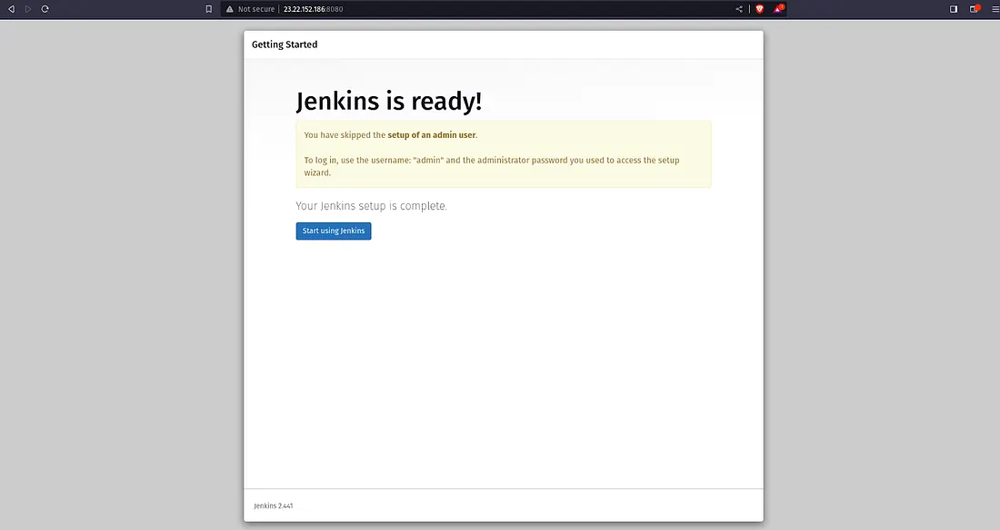

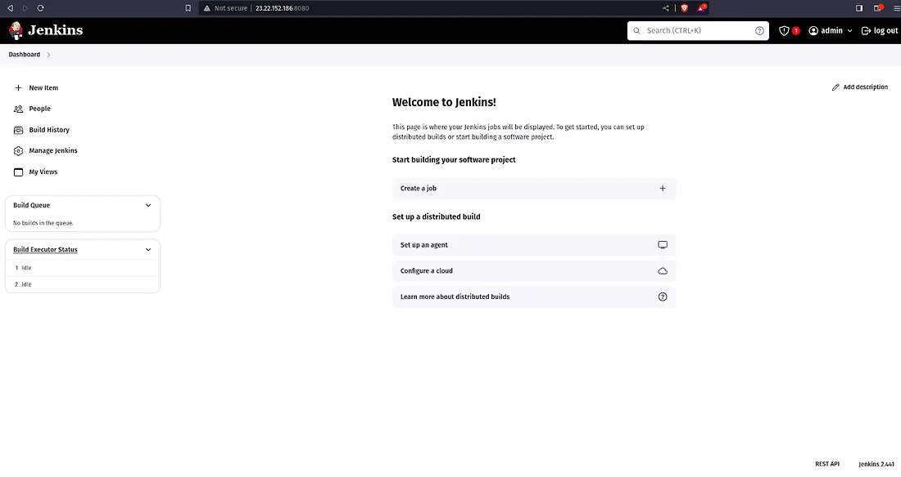

---

## Step 5: Deploy the Amazon EKS Cluster

Next, configure Jenkins so it can authenticate with AWS and deploy infrastructure.

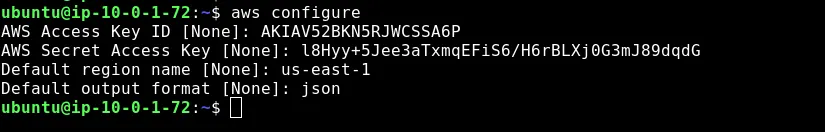

### Install the Required Jenkins Plugins

Navigate to:

```
Manage Jenkins
→ Plugins
→ Available Plugins
```

Install the following plugins:

- AWS Credentials
- Pipeline: AWS Steps

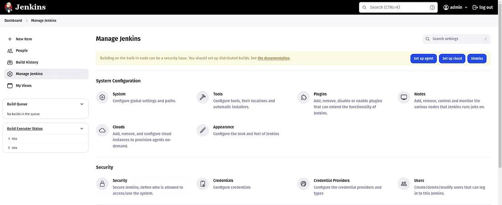


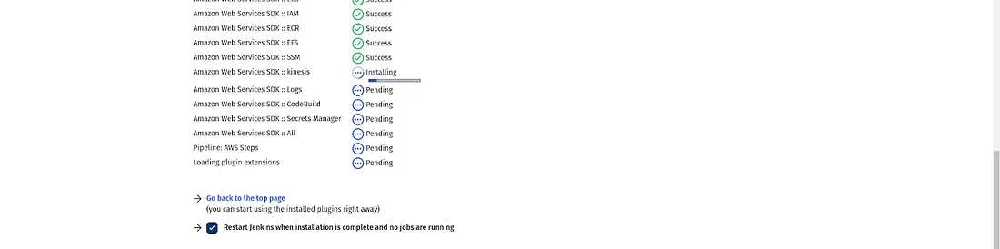

---

### Restart Jenkins

After installing the plugins, restart the Jenkins service.

You can either:

- Select **Restart Jenkins when installation is complete**, or
- Restart it manually.

Log back into Jenkins once the restart is complete.

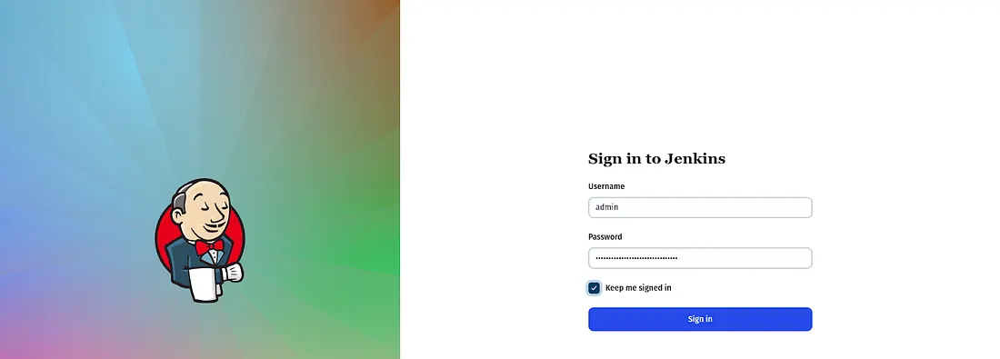

---

### Configure AWS Credentials

Navigate to:

```
Manage Jenkins
→ Credentials
→ System
→ Global Credentials
```

Create a new credential with:

- **Kind:** AWS Credentials
- **ID:** `sally` *(or your preferred credential ID)*
- **AWS Access Key**
- **AWS Secret Access Key**

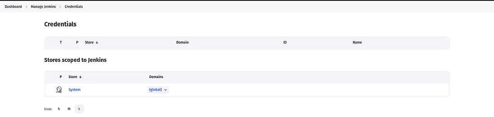

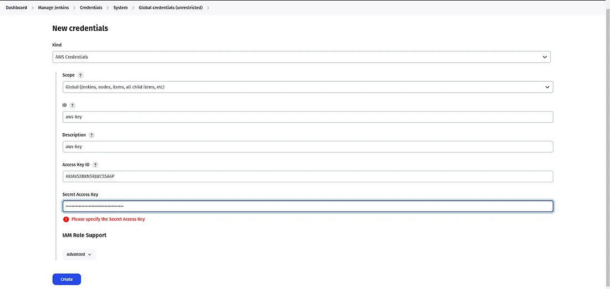

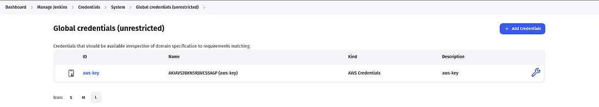

---

### Configure GitHub Credentials

If your GitHub repository is private, add GitHub credentials as well.

Navigate to the same **Credentials** section and create a new credential using:

- GitHub Username
- GitHub Personal Access Token (PAT)

These credentials will allow Jenkins to clone your private repository and push code changes when required.

---

### Create the EKS Cluster

Run the following commands to provision the Amazon EKS cluster.

```bash
eksctl create cluster \
  --name Three-Tier-K8s-EKS-Cluster \
  --region us-east-1 \
  --node-type t2.medium \
  --nodes-min 2 \
  --nodes-max 2
```

Once the cluster has been created, configure your local kubeconfig.

```bash
aws eks update-kubeconfig \
  --region us-east-1 \
  --name Three-Tier-K8s-EKS-Cluster
```

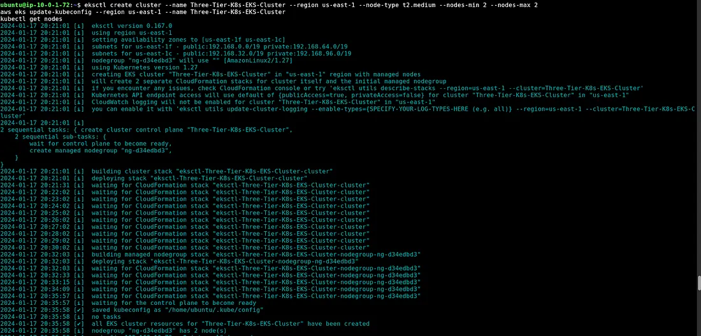

---

### Verify the Cluster

Confirm that the worker nodes are in the **Ready** state.

```bash
kubectl get nodes
```

Example output:

```text
NAME                            STATUS   ROLES    AGE   VERSION
ip-10-0-1-120.ec2.internal      Ready    <none>   3m    v1.xx.x
ip-10-0-2-180.ec2.internal      Ready    <none>   3m    v1.xx.x
```

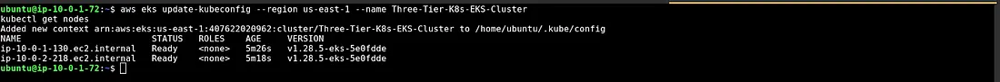
